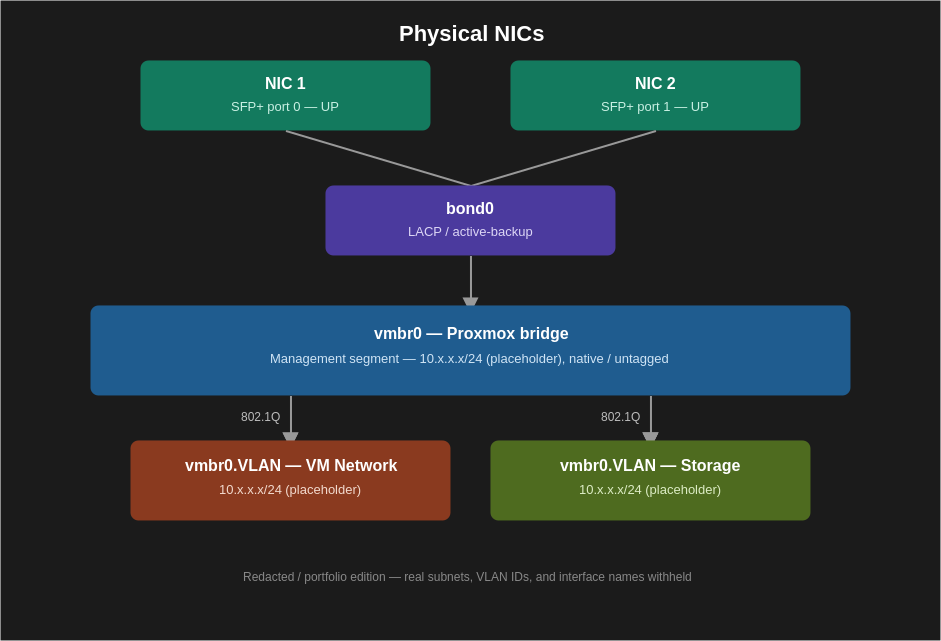

# VPS Production Network Segmentation

Production-oriented VPS network segmentation architecture designed around
Sophos Firewall, Proxmox Cluster, VLAN isolation, redundant connectivity,
and secure infrastructure operations.

## Overview

This project documents the design and implementation approach for a
segmented VPS production environment.

The architecture separates:

- Management traffic
- Internet-facing virtual machines
- Cluster/storage replication traffic

The design focuses on network isolation, high availability, controlled
Internet access, secure administration, and operational consistency.

## Architecture

## Core Architecture

Internet
↓
Dual ISP Connectivity
↓
Sophos Firewall
↓
Core Switch
↓
Proxmox Cluster
↓
Segmented VLAN Networks

### Network Segments

| VLAN | Purpose |
|---|---|
| Management | Firewall, Proxmox and infrastructure management |
| VM Network | Internet-facing virtual machines |
| Storage | Cluster/storage replication |

## Key Design Principles

- Management traffic isolated from Internet access
- Storage traffic isolated from WAN
- VM Internet access controlled through firewall/NAT policies
- Redundant ISP connectivity
- LACP/bonded infrastructure uplinks
- VLAN-aware Proxmox networking
- Dedicated storage replication network
- Controlled administrative access
- Centralized security monitoring

## Technology Stack

- Sophos Firewall
- Sophos Managed Switch
- Proxmox VE
- Linux / Ubuntu Server
- VLAN / 802.1Q
- LACP
- NAT
- IPMI
- SIEM / centralized logging

## Proxmox Network Design

The Proxmox networking model uses a bonded interface and VLAN-aware
bridging to provide separated management, VM and storage networks.

Example:

Physical NICs
↓
Bond
↓
Proxmox Bridge
├── Management VLAN
├── VM VLAN
└── Storage VLAN

## Security Controls

The architecture applies several security controls:

- Restricted management access
- VLAN-based network isolation
- Storage network isolation
- Firewall policy enforcement
- Controlled NAT
- Disabled unused switch ports
- SSH instead of Telnet
- Strong IPMI authentication
- Centralized logging
- Regular firewall and VLAN rule reviews

## High Availability

The architecture incorporates:

- Dual ISP connectivity
- LACP/bonded links
- Three-node Proxmox cluster
- Dedicated storage replication
- Failover procedures
- Backup and rollback procedures

## Monitoring

The environment is designed to monitor:

- Firewall health
- Switch health
- Interface utilization
- Bond status
- VLAN errors
- Proxmox cluster health
- Storage replication
- VM availability
- Internet latency

Alerts can be generated for:

- Firewall failure
- Node failure
- Storage failure
- LACP failure
- High resource utilization
- VLAN misconfiguration

## Operational Approach

The project also documents:

1. Implementation procedures
2. Verification procedures
3. Monitoring
4. Security controls
5. Backup procedures
6. Rollback procedures
7. Troubleshooting
8. Change management
9. Maintenance procedures

## Project Outcome

The resulting architecture provides a structured approach to securing and
operating VPS infrastructure through network segmentation, controlled
access, redundancy and operational procedures.

## Documentation

Detailed implementation documentation is maintained separately from the
public repository where required to protect sensitive infrastructure
information.

## Author

**Prakash Raj D**

Cybersecurity Professional | IT Infrastructure & SecOps

GitHub:
https://github.com/Prakashraj-D
